```{r setup, include=FALSE}
library(flexdashboard)
```


Row
-----------------------------------------------------------------------

### Flatly (default)
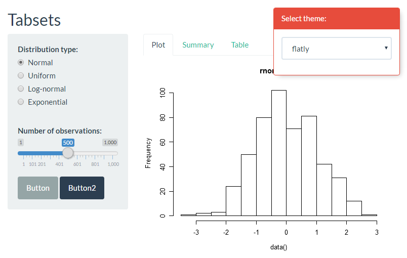
<br>
[complete layout](http://bootswatch.com/flatly/)


### Cerulean

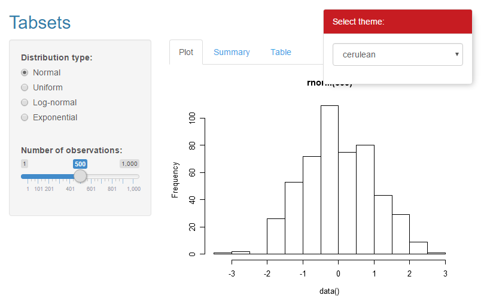
<br>
[complete layout](http://bootswatch.com/cerulean/)

### Cyborg
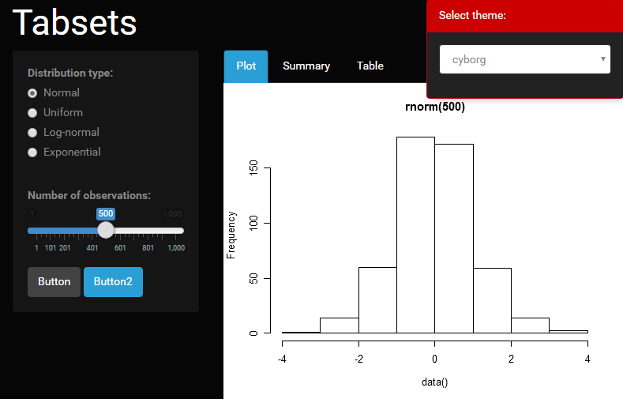
<br>
[complete layout](http://bootswatch.com/cyborg/)


### Darkly

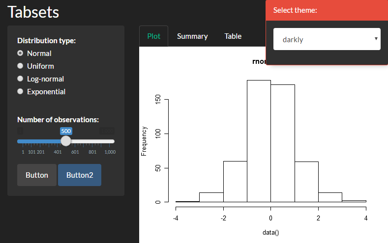
<br>
[complete layout](http://bootswatch.com/darkly/)

Row
-----------------------------------------------------------------------


### Journal
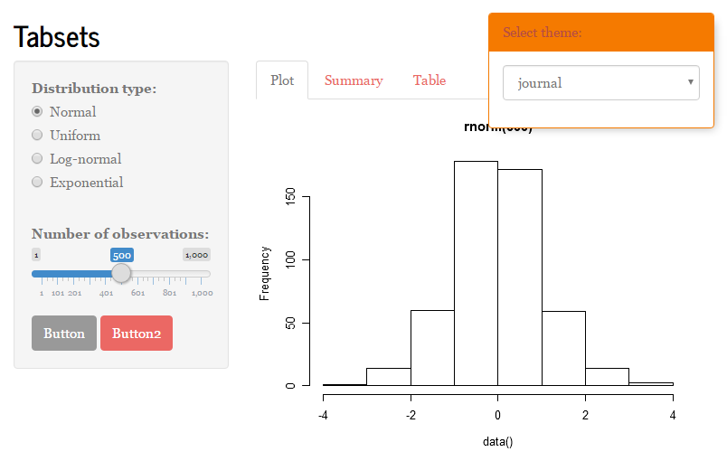
<br>
[complete layout](http://bootswatch.com/journal/)


### Lumen

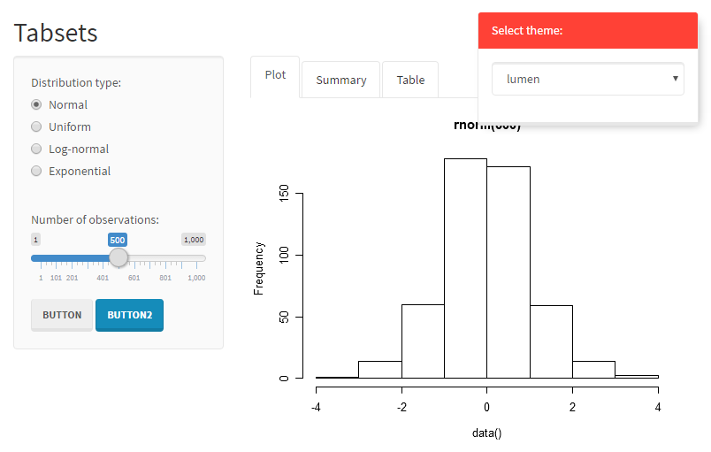
<br>
[complete layout](http://bootswatch.com/lumen/)

### Paper
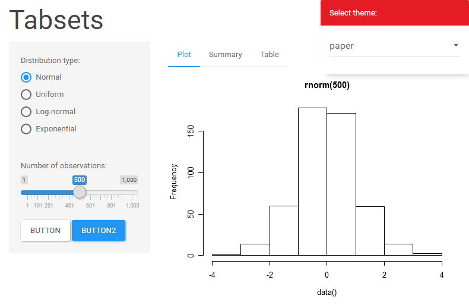
<br>
[complete layout](http://bootswatch.com/paper/)


### Sandstone

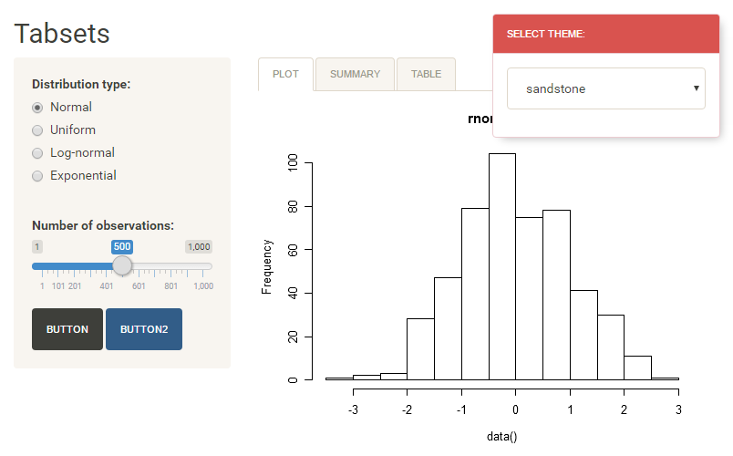
<br>
[complete layout](http://bootswatch.com/sandstone/)

Row
-----------------------------------------------------------------------


### Simplex
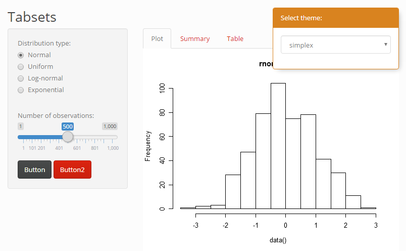
<br>
[complete layout](http://bootswatch.com/simplex/)


### Slate

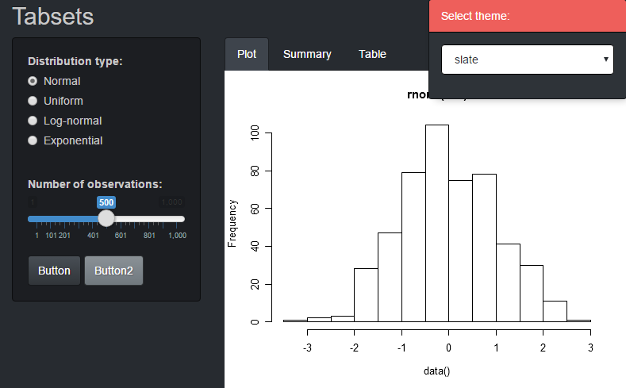
<br>
[complete layout](http://bootswatch.com/slate/)

### Spacelab
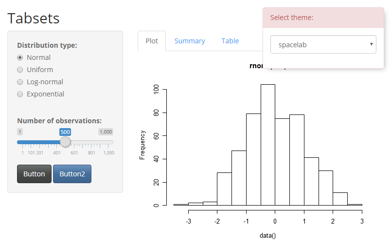
<br>
[complete layout](http://bootswatch.com/spacelab/)


### Superhero

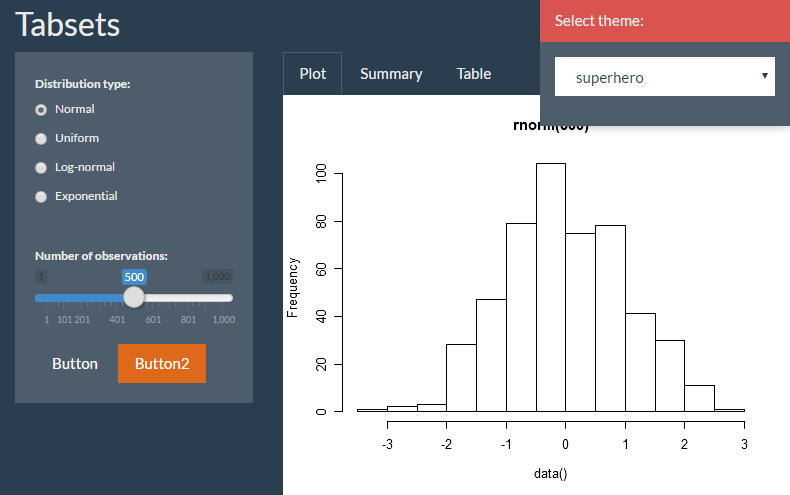
<br>
[complete layout](http://bootswatch.com/superhero/)

Row
-----------------------------------------------------------------------


### United
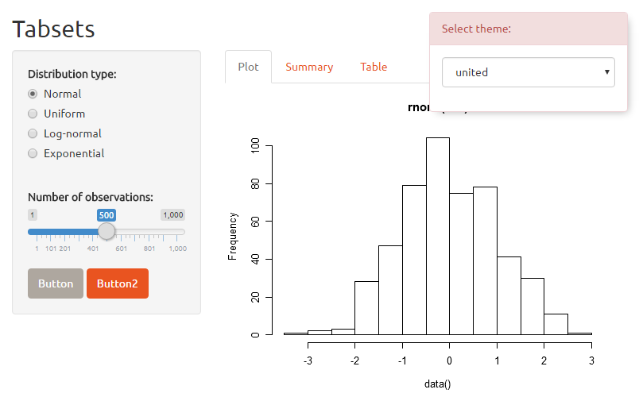
<br>
[complete layout](http://bootswatch.com/united/)


### Yeti

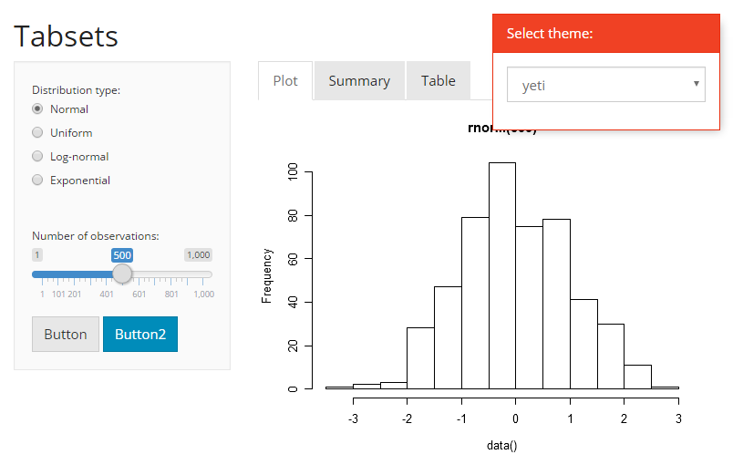
<br>
[complete layout](http://bootswatch.com/yeti/)